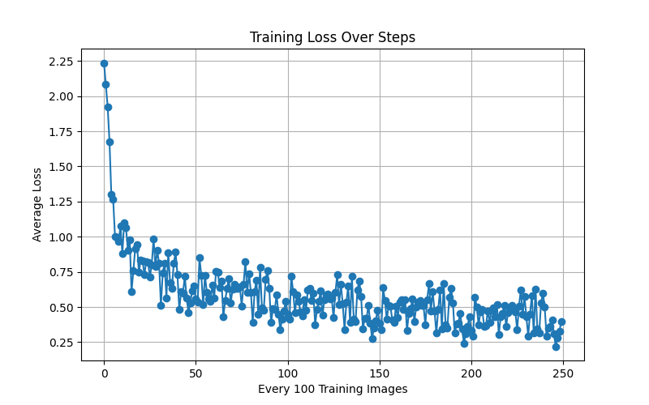
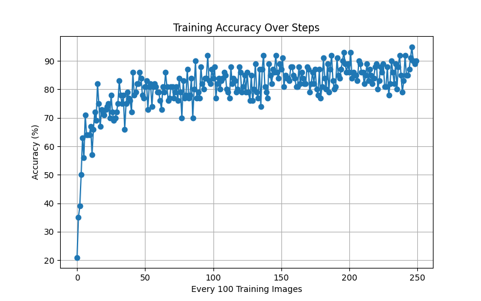
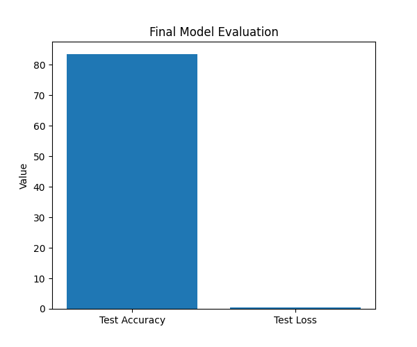
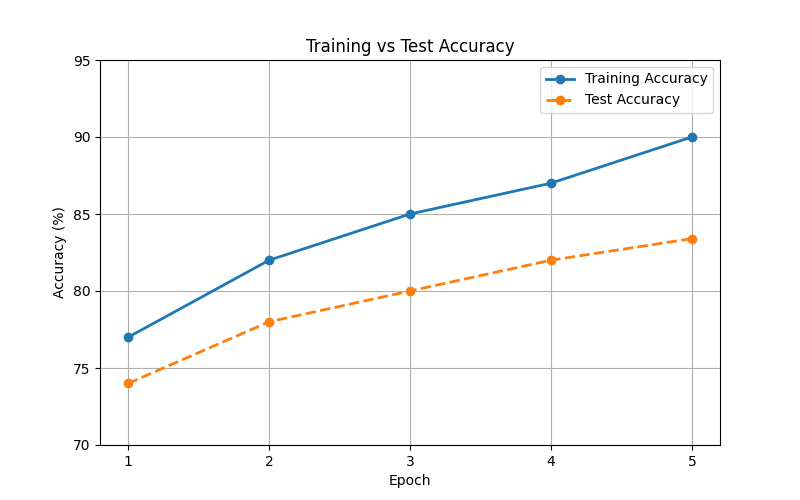
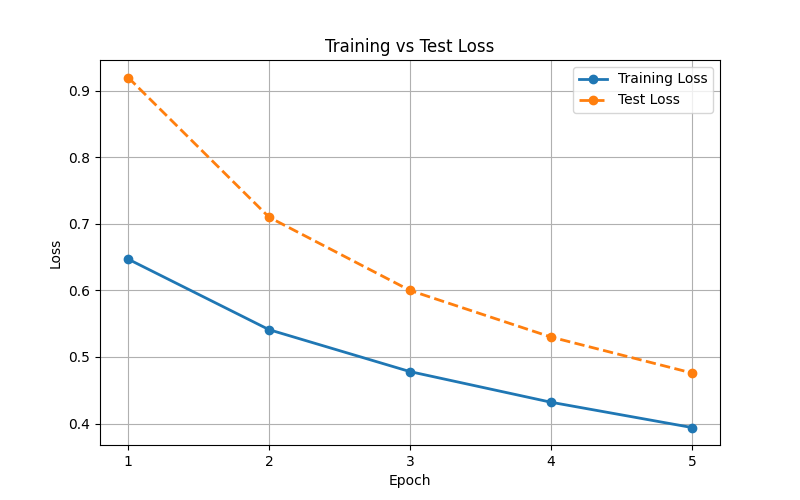

# Fashion MNIST CNN from Scratch

## Project Title
UE24CS645BC2_pes1pg25cs101_Fashion_MNIST_CNN

## Abstract
This project implements a Convolutional Neural Network from scratch using Python and NumPy for Fashion MNIST image classification. The model includes convolution, max pooling, flattening, fully connected Softmax layer, forward pass, backward pass, training, and evaluation.

The model achieved a final test accuracy of **83.4%**.

## Dataset
Fashion MNIST contains grayscale images of clothing items.

| Property | Value |
|---|---|
| Total Images | 70,000 |
| Training Images | 60,000 |
| Testing Images | 10,000 |
| Image Size | 28 × 28 |
| Classes | 10 |
| Type | Grayscale |

## CNN Architecture

| Layer | Purpose |
|---|---|
| Input Layer | Takes 28×28 image |
| Convolution Layer | Extracts features using 3×3 filters |
| MaxPool Layer | Reduces feature map size |
| Flatten Layer | Converts feature map to vector |
| Softmax Layer | Gives class probabilities |

## Hyperparameters

| Parameter | Value |
|---|---|
| Filters | 8 |
| Filter Size | 3×3 |
| Pool Size | 2×2 |
| Learning Rate | 0.003 |
| Epochs | 5 |
| Training Images Used | 5000 |
| Test Images Used | 1000 |

## Results

| Metric | Value |
|---|---|
| Best Training Accuracy | 95% |
| Test Loss | 0.4758 |
| Test Accuracy | 83.4% |

## Performance Comparison

| Configuration | Epochs | Training Images | Learning Rate | Test Accuracy |
|---|---|---|---|---|
| Initial Model | 3 | 1000 | 0.005 | 77.0% |
| Improved Model | 5 | 5000 | 0.003 | 83.4% |

## Epoch-wise Comparison

| Epoch | Training Accuracy (%) | Test Accuracy (%) | Training Loss | Test Loss |
|---|---|---|---|---|
| 1 | 77.0 | 74.0 | 0.647 | 0.920 |
| 2 | 82.0 | 78.0 | 0.541 | 0.710 |
| 3 | 85.0 | 80.0 | 0.478 | 0.600 |
| 4 | 87.0 | 82.0 | 0.432 | 0.530 |
| 5 | 90.0 | 83.4 | 0.394 | 0.476 |

## Visualizations

### Training Loss


### Training Accuracy


### Final Evaluation


### Training vs Test Accuracy


### Training vs Test Loss


## CNN vs Traditional Neural Network

| Feature | Traditional Neural Network | CNN |
|---|---|---|
| Feature Extraction | Manual | Automatic |
| Spatial Information | Lost | Preserved |
| Image Classification | Less efficient | More efficient |
| Parameters | More | Fewer due to shared filters |
| Accuracy | Lower | Higher |

## Project Structure

```text
UE24CS645BC2_pes1pg25cs101_Fashion_MNIST_CNN
│── main.py
│── graphs.py
│── README.md
│── requirements.txt
│── .gitignore
│── final_evaluation.png
│── training_accuracy.png
│── training_loss.png
│── train_test_accuracy.png
│── train_test_loss.png
│
├── src
│   ├── convolution.py
│   ├── maxpool.py
│   └── softmax.py
````

## How to Run

### Step 1: Create virtual environment

```bash
python -m venv .venv
```

### Step 2: Activate virtual environment

```bash
.\.venv\Scripts\Activate.ps1
```

### Step 3: Install dependencies

```bash
python -m pip install -r requirements.txt
```

### Step 4: Run CNN model

```bash
python main.py
```

### Step 5: Generate graphs without retraining

```bash
python graphs.py
```

## Libraries Used

| Library    | Purpose                       |
| ---------- | ----------------------------- |
| NumPy      | Matrix operations             |
| TensorFlow | Loading Fashion MNIST dataset |
| Matplotlib | Graphs and visualizations     |

## GitHub Repository

[https://github.com/Deepa-12345678/DLTP-](https://github.com/Deepa-12345678/DLTP-)

## Conclusion

This project successfully demonstrates how a CNN works internally. The convolution layer, max pooling layer, Softmax layer, forward propagation, backward propagation, training, and evaluation were implemented manually using NumPy. The final model achieved **83.4% test accuracy**, showing that a CNN built from scratch can effectively classify Fashion MNIST images.

